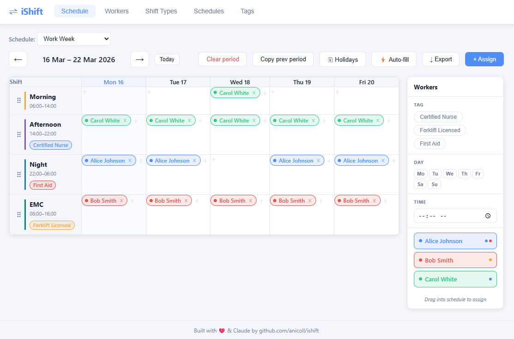

# iShift

A browser-based shift scheduling tool for small teams.

**Live site:** https://anicoll.github.io/ishift/



## Features

- **Schedule** — assign workers to shifts across a configurable calendar view with drag-and-drop, auto-fill, CSV/PDF export, and bank holiday support
- **Schedule definitions** — define named period templates (e.g. "Work Week", "Fortnight") with a custom length and working days
- **Workers** — manage your team with roles, tag-based qualifications, per-day availability windows, max shifts per week, and time-off periods
- **Shift types** — define shifts with start/end times, required tags, and minimum worker counts
- **Tags** — create skill or certification tags (e.g. "First Aid", "Forklift Licensed") to control worker eligibility per shift
- **Persistent state** — all data is saved to browser `localStorage` with no backend required

## Tech

- React 19 + TypeScript, bundled with Vite
- No external UI library — custom CSS
- No router — tab navigation via React state
- Vitest for unit tests
- PDF export via a Go module compiled to WebAssembly (`wasm/`, built with `./build-wasm.sh`)

## Development

```bash
npm install
npm run dev      # dev server at localhost:5173
npm test         # unit tests
npm run build    # production build → dist/
```

## Docs

Developer overview: [`docs/dev/overview.md`](docs/dev/overview.md)
